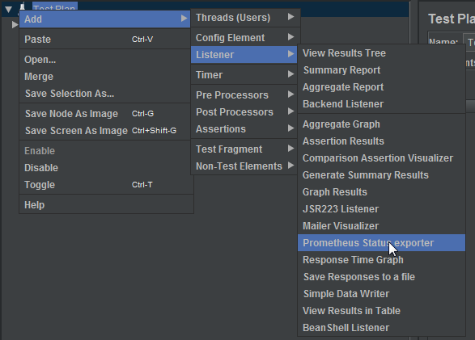

# jmeter-prometheus-plugin

To use plugin execute:

```
mvn clean package
cd target
curl -o jmeter.zip https://mirror.klaus-uwe.me/apache//jmeter/binaries/apache-jmeter-5.3.zip
unzip jmeter.zip

cp jmeter-prometheus-plugin.jar apache-jmeter-5.3/lib/ext/
cp jars/* apache-jmeter-5.3/lib/ext/
cd ..


```

Running:

```
./target/apache-jmeter-5.3/bin/jmeter

```

And copy all *.jar file from target folder int your jMeter /lib/ext directory
To use plugin add Prometheus Status Exporter to your Test Plan




It exposes pre default port 8080 and url http://<your-server>:8080/metrics will output current metrics. 
